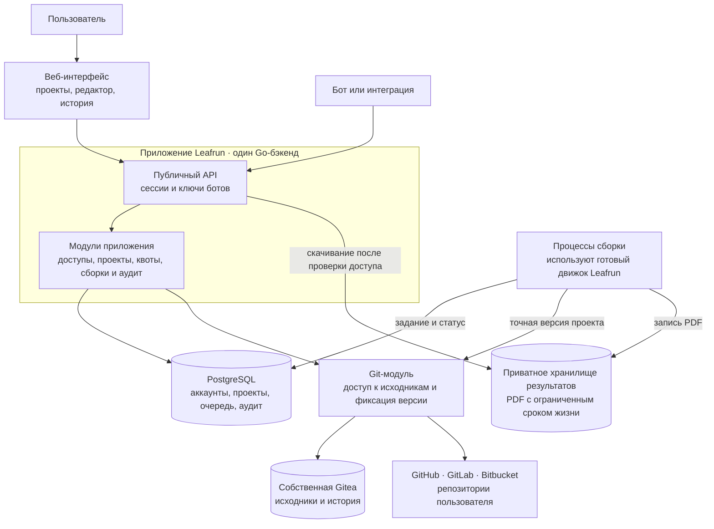
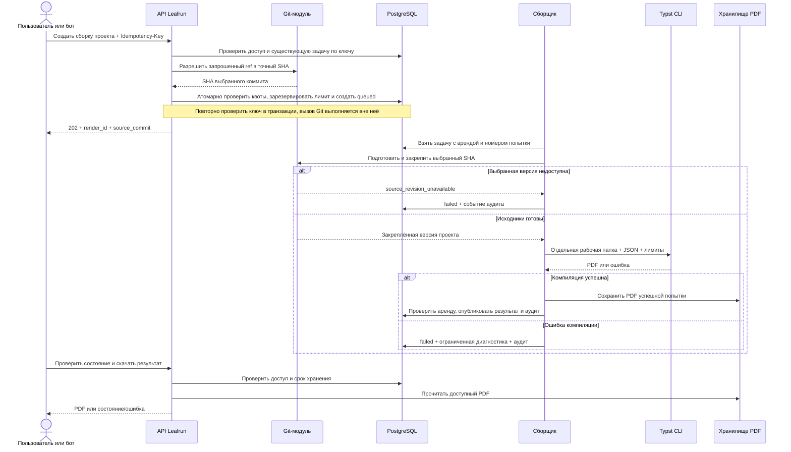
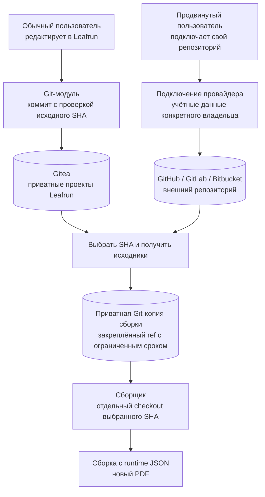
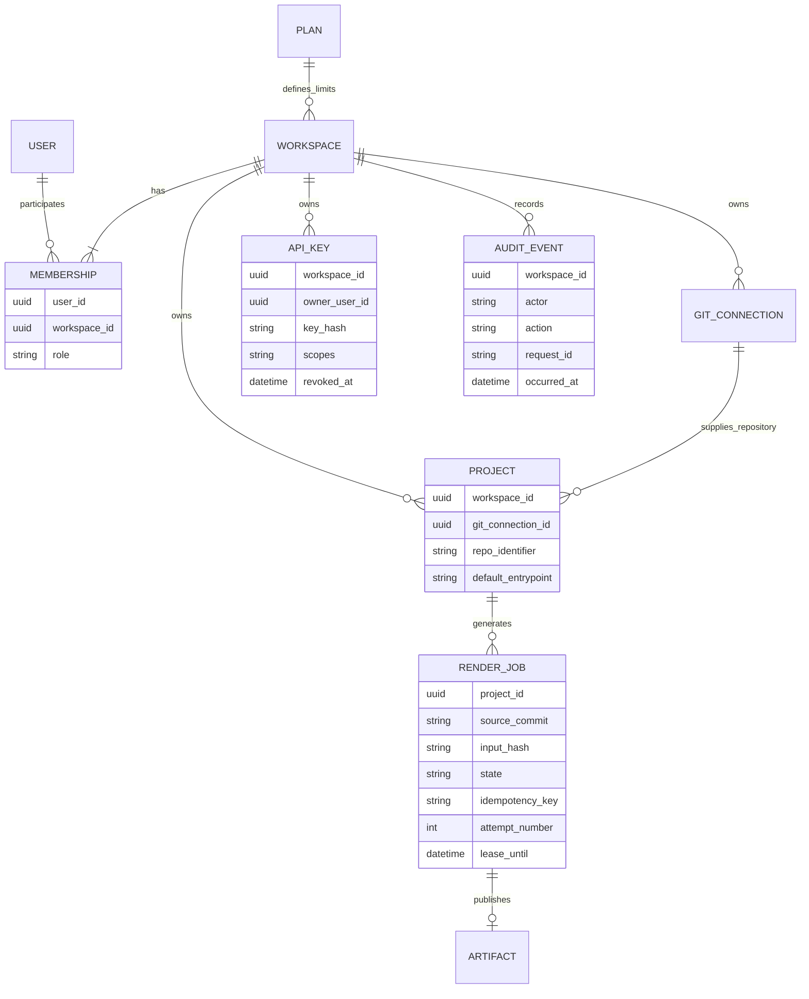
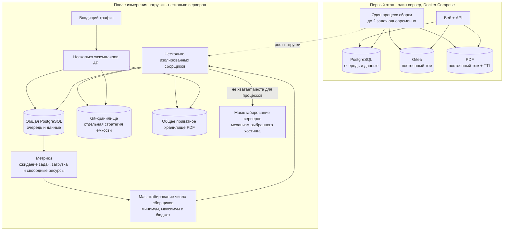

# Leafrun: SaaS для генерации документов

Черновик v0 для обсуждения, 6 октября 2026 года. Это проектирование следующего этапа: описанные ниже сервисы SaaS ещё не реализованы.

7 октября схемы перенесены на [доску Miro](https://miro.com/app/board/uXjVEd6scg8=/): пять схем в отдельных фреймах и область для вопросов и правок.

Предлагаю начать с одного приложения на Go, отдельного процесса сборки, PostgreSQL и собственной Gitea. Пользователь работает с документом через веб-интерфейс, бот — через API. Исходники и история находятся в Git; очередь, доступы, тарифы и аудит — в базе приложения. Новые серверы добавляем после появления измеримой нагрузки.

Схемы ниже можно редактировать прямо в этом Markdown. Отдельные исходники Mermaid и изображения SVG находятся в [diagrams/](diagrams/); исходник `.mmd` можно открыть в [Mermaid Live Editor](https://mermaid.live/).

## Что уже есть и что нужно добавить

| Часть | Состояние |
|---|---|
| Git → отдельная рабочая папка → Typst → PDF | Реализовано в Leafrun |
| Синхронный `POST /api/render`, Bearer-ключ, SHA источника, лимиты и очистка | Реализовано |
| Git-кэш, публичные внешние репозитории, приватная Gitea | Реализовано |
| Docker Compose с движком и собственной Gitea | Реализовано и проверено |
| Аккаунты, рабочие пространства, роли, ключи отдельных ботов | Требуется разработать |
| Веб-редактор, шаблоны, управление проектами | Требуется разработать |
| Очередь, хранение PDF, история сборок, тарифы, аудит | Требуется разработать |
| Совместная работа и автоматическое масштабирование | Следующие этапы |

Typst использует собственную разметку `.typ`. Markdown предлагаю поддержать через адаптер: Markdown → содержимое Typst → PDF. Кандидат — пакет [cmarker](https://typst.app/universe/package/cmarker/); его совместимость с нашим Typst и нужными возможностями Markdown ещё надо проверить. Для обычного Markdown отключаем вставки произвольного Typst через `raw-typst: false`. Математика и расширения Markdown требуют отдельного решения. [Синтаксис Typst](https://typst.app/docs/reference/syntax/).

## 1. Общая архитектура

Все блоки, кроме существующего движка и Gitea, обозначают предлагаемую разработку. Блоки внутри приложения — модули одного Go-бэкенда, а не отдельные микросервисы.

Git-модуль сначала остаётся частью бэкенда и процесса подготовки сборок. Он скрывает различия провайдеров и проверяет доступ к каждому подключению. Сборщик получает только исходники своей задачи, без общего набора токенов пользователей.

PostgreSQL хранит задания вместе с состоянием приложения. Для получения задания несколькими сборщиками можно использовать `FOR UPDATE SKIP LOCKED`; это [поддержанный сценарий очереди](https://www.postgresql.org/docs/current/sql-select.html). Redis на первом этапе не обязателен.

## 2. Путь от запроса до PDF

Долгую сборку в SaaS выносим из HTTP-запроса. Предлагаемый публичный API:

| Запрос | Результат |
|---|---|
| `POST /v1/projects/{project_id}/renders` | `202`, идентификатор сборки, состояние, выбранный SHA |
| `GET /v1/renders/{render_id}` | Состояние, SHA, ограниченная диагностика |
| `GET /v1/renders/{render_id}/pdf` | PDF после проверки доступа, пока не истёк срок хранения |
| `POST /v1/renders/{render_id}/cancel` | Отмена задания или выполняющейся сборки |

В запросе передаются `ref`, `entrypoint` и `data`; адрес репозитория берём из проекта. `Idempotency-Key` повторно возвращает уже созданную задачу в том же рабочем пространстве. Повтор ключа с другим содержимым даёт `409`. Данные JSON не коммитим в Git.

Для очереди и повторных попыток JSON временно сохраняем как приватные входные данные задачи с ограничением размера. Доступ к нему получает только процесс обработки этой задачи; после завершения и окончания окна повторов данные удаляем. В манифесте и аудите остаётся хеш.

Состояния: `queued → preparing → rendering → publishing → succeeded`; также `failed`, `canceled`, `expired`. При ошибке Typst ветка публикации не выполняется: сохраняем ограниченную диагностику и завершаем задачу.

Аренду задачи продлеваем heartbeat-сообщениями. После падения процесса задачу можно повторить; исполнение допускает несколько попыток. Номер попытки защищает публикацию от сборщика с просроченной арендой. Временные файлы, непривязанные PDF и закреплённые версии удаляет периодическая уборка. Повторяем только временные инфраструктурные ошибки, с ограничением числа попыток; ошибки разметки автоматически не повторяем.

В манифесте сборки сохраняем SHA, entrypoint, хеш JSON, формат входа, версии Typst и адаптера. Это позволяет объяснить результат. Для воспроизводимости потребуется также фиксировать пакеты, шрифты и окружение. Таймаут исполнения остаётся отдельным от времени ожидания в очереди.

## 3. Хранение проектов в Git

Для обычного пользователя создание проекта создаёт приватный репозиторий в Gitea. Сохранение в редакторе создаёт коммит. Если документ успел изменить другой пользователь, проверка исходного SHA возвращает конфликт: нельзя молча перезаписать его работу. Gitea даёт хранение и историю, а аккаунты и разрешения SaaS проверяет Leafrun.

Внешние подключения на первом этапе позволяют читать и собирать репозиторий. Запись обратно через OAuth/PAT, вебхуки и автоматические сборки добавляем отдельно. Токены шифруем, ограничиваем провайдером и рабочим пространством; в URL и логи их не помещаем. Для собственного Git-сервера нужны проверенные адреса и правила исходящего доступа.

SHA фиксируем до постановки задания в очередь. Но одного SHA недостаточно: force-push может удалить его из доступной истории. Поэтому подготовка сохраняет нужные объекты и служебный ref в приватной Git-копии с ограниченным сроком хранения. Для MVP такую копию можно держать в служебных репозиториях собственной Gitea. Если коммит исчез до получения копии, возвращаем явную ошибку; последующие попытки используют уже закреплённую версию.

Служебные копии закрыты от пользователей, изолированы по рабочему пространству/подключению и ограничены по объёму и времени. Это новый механизм SaaS. Существующий удаляемый кэш движка остаётся ускорением, а не единственным местом закрепления версии. Рабочие папки сборщиков локальные и не разделяются между серверами.

PDF, runtime JSON и журнал сборок храним отдельно от исходников. В начале PDF могут лежать на приватном постоянном томе одного сервера. При нескольких серверах потребуется общее хранилище результатов, например объектное. Это не меняет хранение проектов в Git. Для Git-истории, скачивания и временных копий нужны отдельные дисковые лимиты: ограничение файлов проекта не ограничивает всю историю репозитория.

## 4. Пользователи, организации и аудит

Рабочее пространство — единица владения, оплаты и ограничения ресурсов. В бесплатном тарифе оно принадлежит одному человеку; в командном имеет несколько участников. Компания может владеть рабочим пространством без отдельной копии приложения.

Это концептуальная модель, а не готовая схема миграций. Ключ может быть ограничен отдельными проектами; конкретные связи добавим при проектировании API.

| Роль | Доступ |
|---|---|
| Owner | Оплата, участники, все проекты и ключи пространства |
| Admin | Управление участниками и проектами в пределах разрешений владельца |
| Editor | Изменение исходников, запуск сборок, чтение результатов |
| Viewer | Чтение разрешённых исходников и PDF |

Ключ бота имеет область доступа и владельца, хранится в виде хеша, показывается один раз и может быть отозван. Его полномочия не превышают права владельца и рабочего пространства. Проверку пространства выполняем для проекта, задачи, Git-подключения и скачивания PDF.

Аудит фиксирует вход, изменения проекта и доступа, выпуск/отзыв ключа, запуск/отмену/завершение сборки, смену тарифа и результат проверки квоты. Поля события: UTC-время, рабочее пространство, актор, действие, request_id, project_id/render_id, SHA и результат. События не редактируются пользователем; хранение и доступ к ним подчиняются политике тарифа. JSON документа, текст документа, PDF и секреты в аудит не записываем.

Технические логи нужны для диагностики процессов; метрики — для нагрузки и масштабирования. Они отдельны от пользовательского аудита. Сборщик исполняет пользовательский документ с лимитами CPU, памяти, времени, диска и изоляцией файловой системы. Переход к публичному SaaS требует усилить контейнерную изоляцию, ограничить сеть и проверить сценарии доступа между пользователями; один `--root` Typst не покрывает всю эту задачу.

## 5. Тарифы и квоты: исходное предложение

Числа ниже — гипотеза для обсуждения, а не утверждённая коммерческая политика. Для бесплатного тарифа предлагаю одновременно ограничить проекты, собственное хранилище и вычисления.

| Ограничение | Free, черновик | Pro | Team / Company |
|---|---|---|---|
| Участники | 1 | 1 | Несколько, роли и приглашения |
| Проекты | 10 | Больше | Общие проекты пространства |
| Хранение исходников в нашей Gitea | 10 MiB, включая историю и файлы | Больше | Общая квота компании |
| Сборки | 100 принятых задач в месяц | Больше | Общая квота и приоритет |
| Одновременные сборки пространства | 1 | Больше | Настраиваемый предел |
| Совместная работа | Личный проект | Личный проект | Доступ команды, история и конфликты сохранения |
| Хранение результатов и аудита | PDF 24 часа, аудит 30 дней | Дольше | По политике тарифа |

У внешнего репозитория не считаем чужое хранилище как нашу пользовательскую квоту. Но применяем лимиты к скачиванию, временным копиям, размеру проекта и числу сборок. Например, лимит файлов одной сборки 100 MiB и таймаут исполнения 60 секунд наследуем от движка; бесплатное размещение в Gitea всё равно ограничено 10 MiB.

Квоты резервируем атомарно до расходования ресурса. Повтор по ключу идемпотентности не создаёт новую платную задачу. Внутренние повторные попытки не списывают ещё одну сборку; инфраструктурный отказ возвращает резерв. Размер Git-хранилища проверяем перед записью и периодически пересчитываем. Сетевые ограничения, общий дисковый бюджет и справедливое распределение очереди защищают платформу от одного слишком активного клиента.

Тариф хранится в базе как набор разрешений и лимитов. На первом этапе администратор может назначать его вручную; автоматические платежи и провайдера оплаты выбираем отдельно. Совместный доступ с коммитами включаем раньше, чем одновременное редактирование: последнее потребует отдельного протокола согласования изменений и работы при отключении сети.

## 6. Развёртывание и рост нагрузки

Compose достаточен для первого этапа. Когда один сервер становится узким местом, сначала добавляем сборщики и общее хранилище результатов. При выборе Kubernetes число сборщиков может менять [Horizontal Pod Autoscaler](https://kubernetes.io/docs/concepts/workloads/autoscaling/horizontal-pod-autoscale/) по нагрузке и метрикам очереди. Добавление самих серверов — отдельный механизм [node autoscaling](https://kubernetes.io/docs/concepts/cluster-administration/node-autoscaling/).

Главные сигналы: время ожидания самого старого задания, длина очереди, занятость CPU/памяти, длительность и ошибки сборок. У масштабирования есть верхний предел и бюджет; иначе бесплатные запросы могут породить неограниченный счёт. Пока масштаба нет, ограничиваем очередь и показываем ожидание пользователю.

Gitea и PostgreSQL масштабируются отдельно от сборщиков. Нельзя просто поднять несколько экземпляров Gitea с одной SQLite и общим каталогом. На старте остаётся один экземпляр Gitea; дальнейшую БД, диски и отказоустойчивость выбираем по фактической нагрузке. Резервируем данные приложения, Git-репозитории и конфигурацию доступа; проверяем восстановление. Кэш и временные PDF не заменяют резервную копию исходников.

## Порядок реализации

1. Согласовать этот черновик: форматы ввода, роли, бесплатные квоты, границы совместной работы и внешних подключений.
2. Сделать вертикальный сценарий: зарегистрироваться → создать проект в Gitea → сохранить документ → поставить сборку → получить PDF → увидеть историю и аудит.
3. Добавить ключи ботов, внешние Git-подключения, квоты и платные разрешения. До открытия другим пользователям проверить изоляцию данных и исполнения.
4. Добавить командные пространства и разрешение конфликтов сохранения; затем решать, нужен ли редактор с одновременным вводом.
5. Измерить нагрузку и стоимость сборки, после этого включать масштабирование и автоматическую оплату.

Для первого обсуждения достаточно ответить на три вопроса: обычный пользователь пишет Markdown или Typst; совместная работа означает общий проект или одновременное редактирование; бесплатный тариф ограничиваем числом проектов, объёмом Git и числом сборок одновременно или иначе. До этих решений текущий движок можно использовать как готовую основу, а схемы — исправлять по обратной связи.
